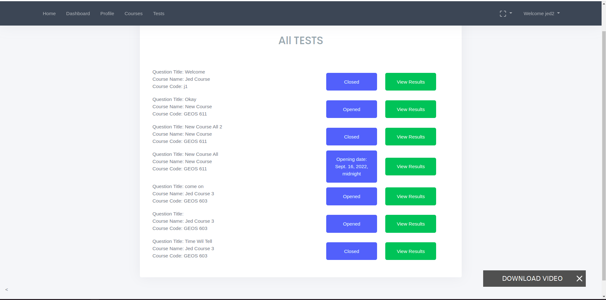
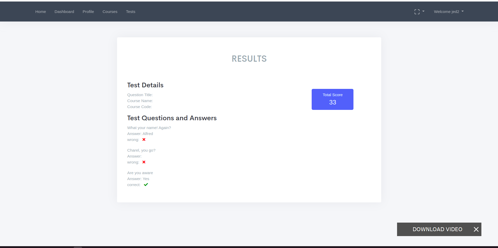
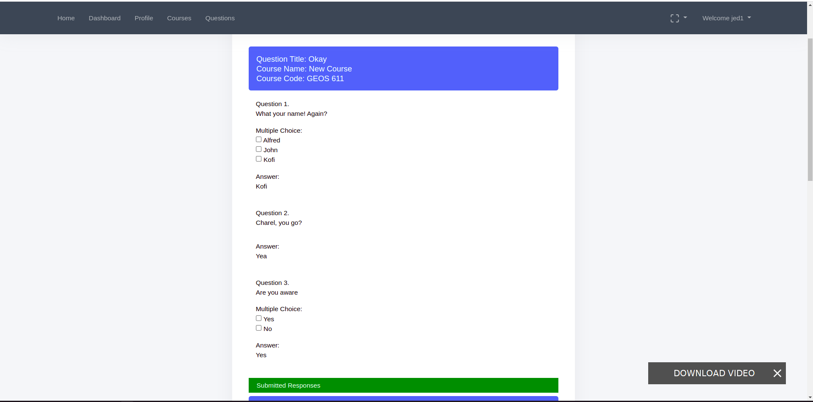
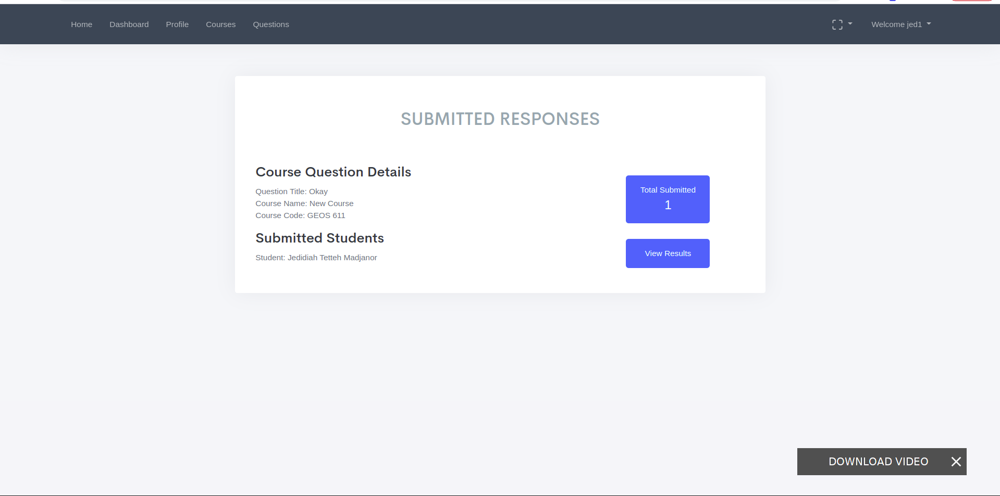
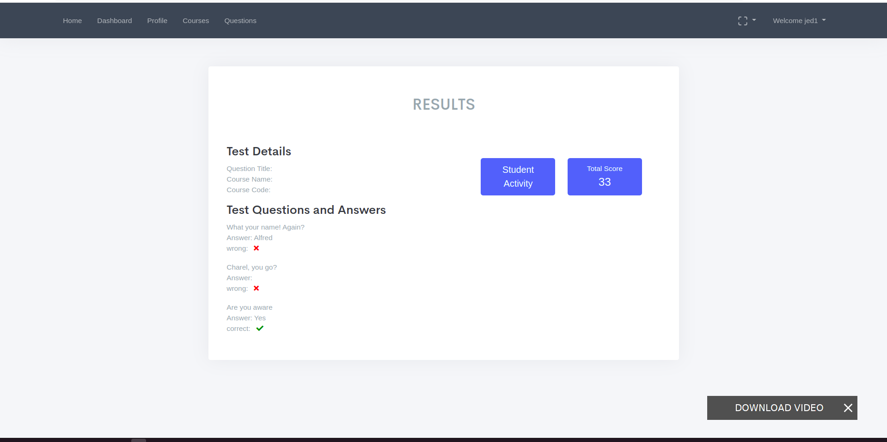

# Test Monitoring App

This is an app that allows teachers to set questions and students to answer those questions. It bridges the gap between teachers and students and 
automatically computes the marks for the taken test.

## Scope

It comes with the following:
- Profile page 	
- Courses page
- Dashboard page.
- Questions pages

## Run
- Create a virtual environment for the project.
- Move into the root folder and open your terminal.
- Activate the virtual environment you created.
- Run pip install -r requirements.txt
- Run python manage.py migrate.
- Run python manage.py runserver
- Open another terminal and start the redis server.
- Open a new terminal then type the following in 'celery -A test_monitor worker -l info'

## OR
 - The app has been dockerised so you can just pull the repository and the run the docker-compose file.

Now your app should be running.

TODO:
- Go to the settings.py and change the db to the db with environmment variables.

## All Tests Page

## Students Results Page

## All Questions Page

## Questions Details Page

## Responses Page

## Teachers Results Page

